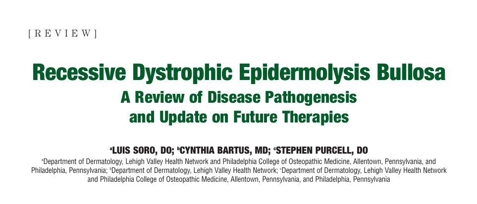
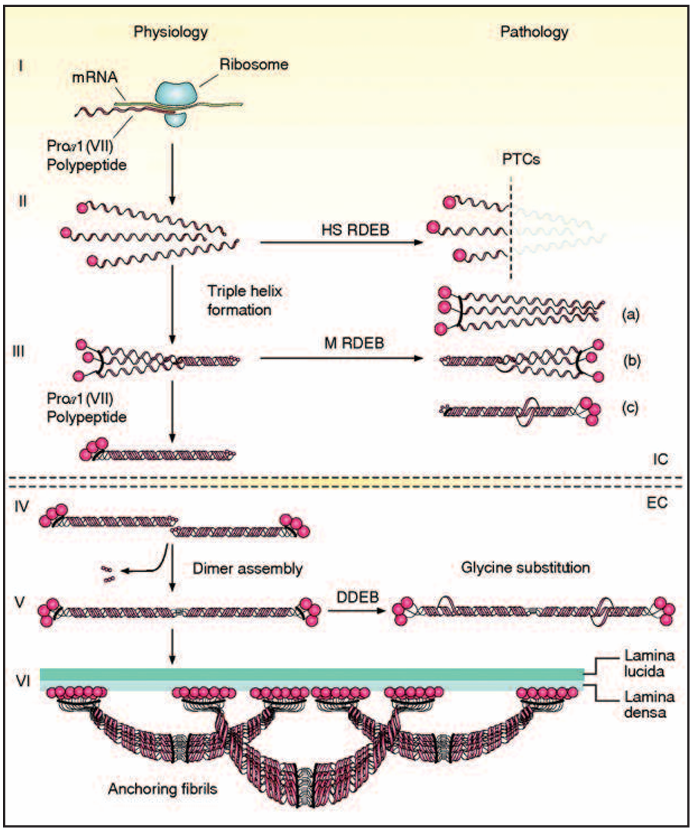
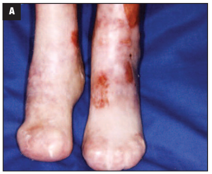
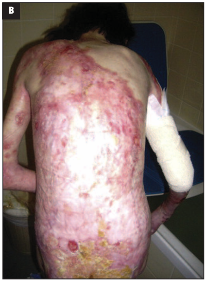

<!-- Title Slide -->
# Understanding Recessive Dystrophic Epidermolysis Bullosa
### A Review of Disease Pathogenesis and Update on Future Therapies
*Instructor: Justin N. Howard*
*Course: Human Anatomy and Physiology I*

---

---

<!-- Disclaimer Slide -->
# Disclaimer
- All work, images, and content used in this lesson belong to their respective authors and contributors.
- This lesson is intended for educational purposes only and is not for commercial use.
- Please respect the intellectual property of the creators by not distributing or reproducing this material without permission.

---

<!-- Lesson Introduction Slide -->
# Lesson Introduction
This lesson accompanies a video viewed in class.  
Watch the video here: [Link to Video](https://youtu.be/bBuvEvEhug0?si=RfefA1MTtRFY_3DB)  
*(Click to watch)*

---

<!-- Follow-Up Video Slide -->
# Follow-Up Video
For a deeper understanding, please watch the follow-up video prepared by me:  
[Follow-Up Video](https://youtu.be/UisHR-IsNFI?si=s6rAiqyHqPBtvwEC)  
*(Click to watch before the next class)*

---

[Link to Paper](https://pubmed.ncbi.nlm.nih.gov/26029334/#:~:text=Objective:%20Review%20the%20pathogenesis%20of%20recessive%20dystrophic%20epidermolysis%20bullosa%20and)

---

# Objectives
- Provide an Introduction to Epithelial and Connective Tissues and Skin
- Explore the Physiology of the Skin
- Understand Nursing Care Knowledge in Skin-Related Conditions, such as Burns and Blistering Disorders

---

# Overview of Recessive Dystrophic Epidermolysis Bullosa
- **Epidermolysis Bullosa (EB)**: A group of inherited skin disorders
- **Subtypes**:
  - EB Simplex (EBS)
  - Junctional EB (JEB)
  - Dystrophic EB (DEB)
  - Kindler Syndrome
- **Focus**: Dystrophic EB, particularly the recessive form (RDEB)

---

# Pathogenesis of RDEB
- **Genetic Basis**: Mutations in the COL7A1 gene
- **Molecular Mechanism**:
  - Deficiency or dysfunction of Type VII Collagen
  - Poor anchoring fibril formation leading to fragile skin

---

- **Impact**:
  - Epidermal-dermal separation, blistering, and scarring

---

---

# Clinical Features
- **Symptoms**:
  - Fragile skin, blistering, erosions
  - Mucosal involvement, esophageal strictures
  - Scarring and fusion of fingers/toes (pseudosyndactyly)
- **Complications**:
  - Increased risk of squamous cell carcinoma
  - Variability: RDEB-GS (Generalized Severe) vs. RDEB-GO (Generalized Other)

---

# Current Management Strategies
- **Wound Care**:
  - Non-adhesive dressings, minimize trauma
- **Multidisciplinary Approach**:
  - Dermatologist, Pediatrician, Gastroenterologist, etc.
- **Supportive Care**:
  - Nutritional support, psychosocial care, cancer screening

---

# Future Therapies
- **Gene Therapy**:
  - Correcting COL7A1 mutations
- **Fibroblast Cell Therapy**:
  - Injecting healthy fibroblasts to produce collagen
- **Bone Marrow Stem Cell Therapy**:
  - Regenerating skin and reducing blistering
- **Protein Therapy**:
  - Delivering Type VII Collagen to the skin

---

# Summary and Conclusion
- RDEB is a severe skin disorder with significant morbidity
- Current management is supportive; however, innovative therapies show promise
- Continued research is critical for future treatment options

---

# References

Marinkovich, M. P. (2015). _Recessive dystrophic epidermolysis bullosa: A review of disease pathogenesis and update on future therapies. Journal of Clinical Aesthetic Dermatology,_ 8(7), 41–46. https://pubmed.ncbi.nlm.nih.gov/26029334

